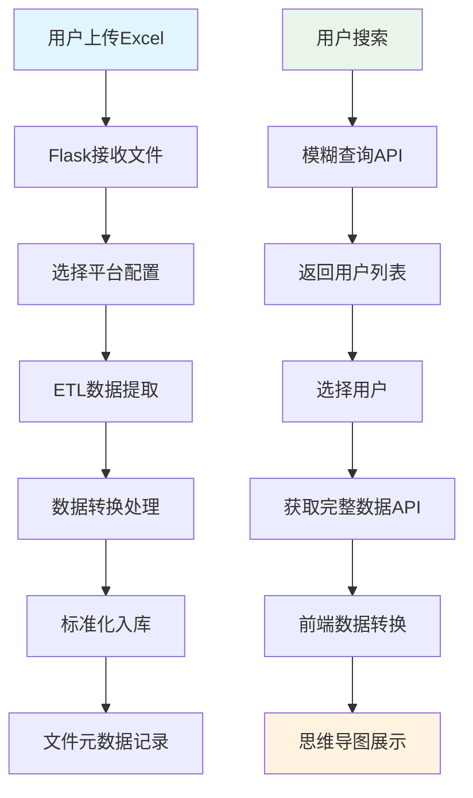

# 项目架构与开发指南

## 📁 项目结构

```
vue-bit-coin-platform/
├── 📁 前端代码 (Vue.js 3)
│   ├── src/
│   │   ├── views/                    # 页面组件
│   │   │   ├── HomeView.vue         # 首页：搜索+文件上传
│   │   │   ├── ResultsView.vue      # 结果页：思维导图+详情展示
│   │   │   └── StudyPageView.vue    # 学习文档页
│   │   ├── components/              # 公共组件
│   │   ├── utils/
│   │   │   └── dataTransform.js     # 数据转换：API数据→思维导图格式
│   │   ├── router/index.js          # 路由配置
│   │   └── App.vue                  # 根组件
│   ├── public/                      # 静态资源
│   ├── package.json                 # 前端依赖管理
│   └── vite.config.js              # 构建配置
│
├── 📁 后端代码 (Flask)
│   ├── app.py                       # 🔥 Flask主应用入口
│   ├── scripts/                     # 核心业务逻辑
│   │   ├── main.py                  # 🔥 ETL引擎核心
│   │   ├── data_extract.py          # 📊 Excel数据提取器
│   │   ├── transforms.py            # 🔄 数据转换函数库
│   │   ├── db_queries.py            # 🗄️ 数据库查询封装
│   │   ├── db_setup.py              # 🏗️ 数据库初始化
│   │   ├── file_metadata.py         # 📋 文件元数据管理
│   │   ├── error_handler.py         # ⚠️ 错误处理机制
│   │   └── utils.py                 # 🛠️ 工具函数
│   └── config/                      # 📝 平台配置文件
│       ├── okx_map.jsonc           # 欧易平台映射配置
│       ├── binance_map.jsonc       # 币安平台映射配置
│       ├── huobi_map.jsonc         # 火币平台映射配置
│       ├── imtoken_map.jsonc       # ImToken映射配置
│       └── tokenpocket_map.jsonc   # TokenPocket映射配置
│
├── 📁 数据存储
│   ├── uploads/                     # 用户上传的文件
│   └── 141数据调证数据/            # 示例数据
│
└── 📁 文档
    ├── README.md                    # 🚀 快速入门指南
    ├── API_DOCUMENTATION.md         # 📖 完整API文档
    └── PROJECT_ARCHITECTURE.md      # 🏗️ 项目架构文档
```

## 🔄 数据流程图



## 🏗️ 核心组件架构

### 1. ETL数据处理引擎

**位置**: `scripts/main.py`

**核心功能**:
- 🔧 配置驱动的数据映射
- 📊 多格式Excel/CSV解析
- 🔄 字段别名智能匹配
- 🛡️ 数据类型转换与验证

**关键流程**:
```python
def run_etl_process_for_file(file_path, company, db_config):
    """ETL主流程"""
    # 1. 加载平台配置模板
    template = load_template_for_company(company)
    
    # 2. 提取数据源
    sources_data = extract_data_from_sources(file_path, template)
    
    # 3. 处理每个目标表
    for destination in template['destinations']:
        processed_df = process_single_destination(destination, sources_data)
        write_df_to_db(processed_df, destination['target_table'], db_config)
```

### 2. 前端数据转换器

**位置**: `src/utils/dataTransform.js`

**核心功能**:
- 🌳 API数据转换为思维导图树形结构
- 📊 数据统计与聚合
- 🎨 节点样式与层级管理

**关键函数**:
```javascript
export function transformToMindMapData(allData, userInfo) {
  // 构建6个顶级节点（5个业务表 + 文件信息）
  return {
    data: { text: rootTitle, expand: true },
    children: [
      buildUsersSection(users),
      buildTransactionsSection(transactions),
      buildAssetMovementsSection(asset_movements),
      buildLoginLogsSection(login_logs),
      buildDevicesSection(devices),
      buildSourceFilesSection(source_files)
    ]
  };
}
```

### 3. 数据库查询层

**位置**: `scripts/db_queries.py`

**核心功能**:
- 🔍 跨表联合查询
- 🎯 模糊搜索实现
- 📋 文件关联查询

**关键逻辑**:
```python
def get_data_from_db(db_config, user_id):
    """根据user_id获取所有关联数据"""
    # 1. 查询5个核心业务表
    # 2. 收集所有source_file_name
    # 3. 查询文件元数据详情
    # 4. 返回完整数据结构
```

## 🎯 设计模式

### 1. 配置驱动开发

**原理**: 通过JSONC配置文件定义数据映射规则，无需修改代码即可支持新平台

**配置文件结构**:
```jsonc
{
  "metadata": { /* 平台元信息 */ },
  "sources": [  /* 数据源定义 */ ],
  "destinations": [ /* 目标表映射 */ ]
}
```

**优势**:
- ✅ 新平台接入只需配置文件
- ✅ 字段映射灵活可配
- ✅ 数据转换函数可插拔

### 2. 前后端分离

**前端职责**:
- 🎨 用户界面展示
- 🌳 数据可视化（思维导图）
- 💾 客户端缓存优化

**后端职责**:
- 📊 数据处理与存储
- 🔍 业务逻辑实现
- 🛡️ 数据验证与错误处理

### 3. 模块化设计

**核心原则**:
- 单一职责：每个模块专注特定功能
- 低耦合：模块间依赖最小化
- 高内聚：相关功能集中管理

## 🔧 扩展指南

### 添加新平台支持

**步骤1**: 创建配置文件
```bash
# 在config/目录创建新配置
cp config/okx_map.jsonc config/newplatform_map.jsonc
# 编辑字段映射规则
```

**步骤2**: 注册配置
```python
# scripts/main.py
TEMPLATE_REGISTRY = {
    'newplatform': [Path("./config/newplatform_map.jsonc")]
}
```

**步骤3**: 前端支持
```javascript
// src/views/HomeView.vue
const companies = ref(['欧意', '币安', '火币', 'ImToken', 'TokenPocket', '新平台']);
```

### 添加数据转换函数

**步骤1**: 定义转换函数
```python
# scripts/transforms.py
def custom_transform_function(value):
    # 自定义转换逻辑
    return transformed_value
```

**步骤2**: 注册函数
```python
# scripts/main.py
FUNCTION_REGISTRY = {
    'custom_transform': transforms.custom_transform_function
}
```

**步骤3**: 配置使用
```jsonc
// config/platform_map.jsonc
{
  "target_field": "field_name",
  "source_field_aliases": ["source_field"],
  "transformations": [{"function": "custom_transform"}]
}
```

## 🛡️ 安全考虑

### 文件上传安全
- ✅ 文件类型验证（仅允许Excel/CSV）
- ✅ 文件大小限制
- ✅ 文件名安全处理
- ✅ 上传路径隔离

### 数据库安全
- ✅ 参数化查询防SQL注入
- ✅ 数据类型验证
- ✅ 错误信息脱敏

### API安全
- ✅ CORS跨域配置
- ✅ 输入参数验证
- ✅ 错误统一处理

## 📈 性能优化

### 前端优化
- 💾 智能缓存机制：首次加载后缓存完整数据
- 🔄 按需加载：节点点击时才加载详细信息
- 📊 分页展示：大数据量分页处理

### 后端优化
- 🗃️ 数据库索引：关键字段建立索引
- 📦 批量处理：Excel数据批量入库
- 🔍 查询优化：避免N+1查询问题

### 系统优化
- 📁 文件管理：定期清理临时文件
- 📊 监控日志：关键操作日志记录
- ⚡ 异步处理：大文件异步处理

## 🧪 测试策略

### 单元测试
- 数据转换函数测试
- 数据库查询逻辑测试
- 配置文件解析测试

### 集成测试
- API接口端到端测试
- 文件上传处理流程测试
- 前后端数据流测试

### 性能测试
- 大文件处理性能测试
- 并发用户访问测试
- 数据库查询性能测试

## 🔮 未来扩展方向

### 功能扩展
- 📊 数据分析报表
- 📈 可视化图表
- 🔄 实时数据同步
- 📱 移动端支持

### 技术升级
- 🐳 Docker容器化部署
- ☁️ 云原生架构
- 🔄 微服务拆分
- 📊 大数据处理

### 业务扩展
- 🤖 AI智能分析
- 🔍 高级查询语法
- 📋 自定义报表
- 🔒 权限管理系统

---

**文档维护**: 请在代码变更时同步更新相关文档  
**版本**: v1.0.0  
**最后更新**: 2024年12月18日
